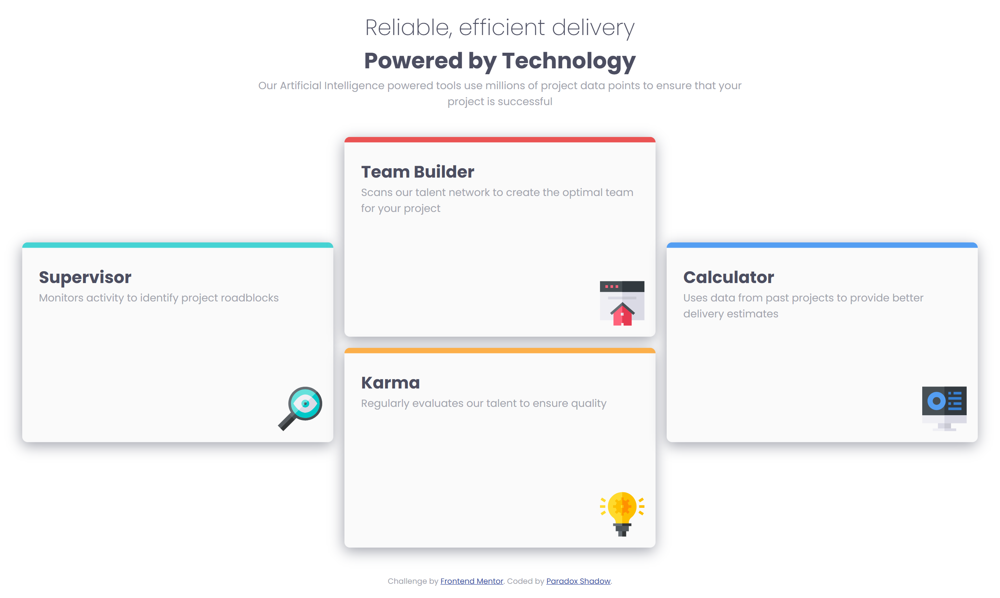
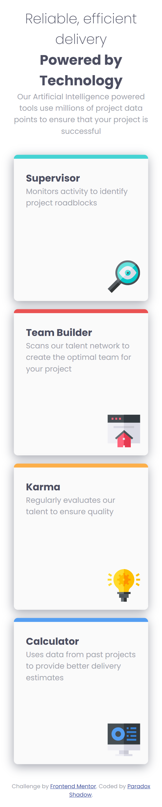

# Frontend Mentor - Four card feature section solution

This is a solution to the [Four card feature section challenge on Frontend Mentor](https://www.frontendmentor.io/challenges/four-card-feature-section-weK1eFYK). Frontend Mentor challenges help you improve your coding skills by building realistic projects. 

## Table of contents

- [Overview](#overview)
  - [The challenge](#the-challenge)
  - [Screenshot](#screenshot)
  - [Links](#links)
- [My process](#my-process)
  - [Built with](#built-with)
  - [What I learned](#what-i-learned)
  - [Continued development](#continued-development)
  - [Useful resources](#useful-resources)
- [Author](#author)
- [Acknowledgments](#acknowledgments)


## Overview

### The challenge

Users should be able to:

- View the optimal layout for the site depending on their device's screen size

### Screenshot





### Links

- Solution URL: [Add solution URL here](https://your-solution-url.com)
- Live Site URL: [Live site](https://taresta.github.io/Four-card-feature/)

## My process

### Built with

- Semantic HTML5 markup
- CSS custom properties
- Flexbox
- CSS Grid
- Mobile-first workflow


### What I learned
I learned quite a bit about the use of flexbox and Grid layout while making this project. Although I can not say I have become proficient in either of these, but now I feel a bit more comfortable in using them than I did before. I hope to continue refining my understanding of these layout algorithms as they are very important and poweful tools in CSS.

I also get the chance to practice clamp function more. I am still learning how to use it effectively. Although I do understand it, but I always hesitate in actually using in projects. Perhaps with more practice, I will get over this hesitation. 
```css
.card-container {
    display: grid;
    grid-template-columns: repeat(auto-fit, minmax(10rem, 1fr));
    gap: 1rem;
    padding: clamp(0.5rem, 0.5rem + 1vw, 1rem);
}
```

### Continued development
I will try to continue refining my understanding of the CSS grid, flexbox and the responsive structure.


### Useful resources

- [An Interactive Guide to Flexbox by Josh W Comeau](https://www.joshwcomeau.com/css/interactive-guide-to-flexbox/) - This helped me so much in improving my understanding of the Flexbox. I had quite a lot of fun in learning about them all thanks to this great resource.
- [An Interactive Guide to CSS Grid by Josh W Comeau](https://www.joshwcomeau.com/css/interactive-guide-to-grid/) - Another great resource by Josh to understand grid layout. Loved it.


## Author

- Website - [Paradox Shadow](https://github.com/Taresta)
- Frontend Mentor - [Paradox](https://www.frontendmentor.io/profile/Taresta)


## Acknowledgments
Thanks to all the great resources out there.

